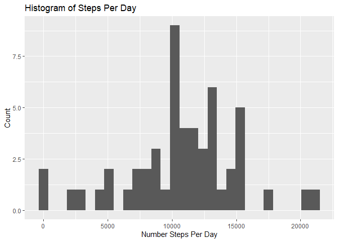
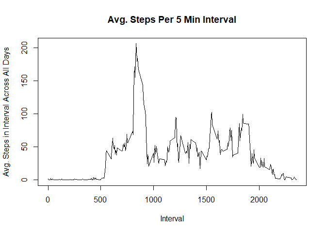
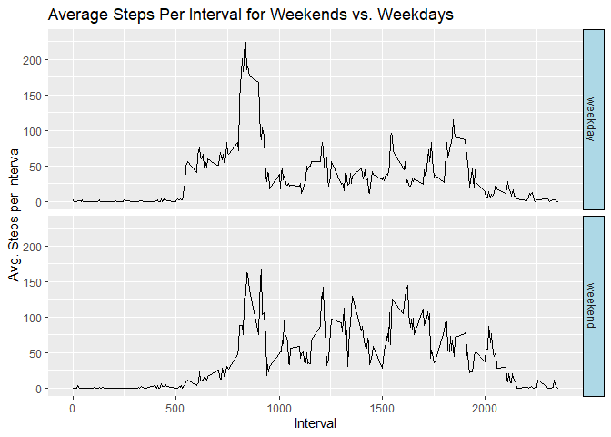

## Loading and preprocessing the data
Code to load the data from the zip file:

```r
activity <- read.csv(unz("activity.zip", "activity.csv"), header = TRUE,sep = ",")
```


## What is mean total number of steps taken per day?
Code to calculate to steps historgram, mean and median:

```r
## Calculate  the total daily steps and write to dataframe "daily_steps"
library(dplyr)
```

```
## 
## Attaching package: 'dplyr'
```

```
## The following objects are masked from 'package:stats':
## 
##     filter, lag
```

```
## The following objects are masked from 'package:base':
## 
##     intersect, setdiff, setequal, union
```

```r
daily_steps<-activity %>%
    group_by(date) %>%
    summarise(Steps_Per_Day = sum(steps))

## Plot Histogram of Total Steps Per Day
library(ggplot2)
p <- ggplot(daily_steps, aes(x=Steps_Per_Day))+geom_histogram()
p+labs(x = "Number Steps Per Day",y="Count",title="Histogram of Steps Per Day")
```

```
## `stat_bin()` using `bins = 30`. Pick better value with `binwidth`.
```

```
## Warning: Removed 8 rows containing non-finite values (stat_bin).
```

<!-- -->

```r
#Calculate and report the mean and median of the total number of steps taken per day
daily_steps_df<-as.data.frame(daily_steps)
Mean_Daily_Steps<-mean(daily_steps_df[,"Steps_Per_Day"],na.rm=TRUE)
Median_Daily_Steps<-mean(daily_steps_df[,"Steps_Per_Day"],na.rm=TRUE)
print(Mean_Daily_Steps)
```

```
## [1] 10766.19
```

```r
print(Median_Daily_Steps)
```

```
## [1] 10766.19
```

## What is the average daily activity pattern?
Code to summarise the daily activity pattern:

```r
## Calculate  the average steps taken in each daily 5 minute interval
avg_steps_by_interval<-activity %>%
    group_by(interval) %>%
    summarise(Avg_Steps_Per_Interval = mean(steps,na.rm=TRUE))

# Plot time series plot of the 5-minute interval averaged across all days
plot(avg_steps_by_interval,type="l",xlab="Interval",ylab="Avg. Steps in Interval Across All Days",main="Avg. Steps Per 5 Min Interval")
```

<!-- -->

```r
## Largest 5 Min Steps Interval?
Most_Steps_Interval<-avg_steps_by_interval[which.max(avg_steps_by_interval$Avg_Steps_Per_Interval),]
print(Most_Steps_Interval)
```

```
## # A tibble: 1 x 2
##   interval Avg_Steps_Per_Interval
##      <int>                  <dbl>
## 1      835                   206.
```

## Imputing missing values
Code to identify and imput missing values:

```r
## Calculate and report the total number of missing values in the dataset
Number_Missing_Entries<-sum(is.na(activity$steps))
print(Number_Missing_Entries)
```

```
## [1] 2304
```

```r
## Strategy to fill missing values: use avg. steps of the relevant interval
#Create a new dataset that is equal to the original dataset but with the missing data filled in.
a2<-merge(activity, avg_steps_by_interval, by.x="interval", by.y="interval")
a2$steps[is.na(a2$steps)] <- a2$Avg_Steps_Per_Interval[is.na(a2$steps)]
activity<-a2

## Plot Revised Histogram of Total Steps Per Day and Recalculate Mean and Median
daily_steps2<-activity %>%
    group_by(date) %>%
    summarise(Steps_Per_Day = sum(steps))

p <- ggplot(daily_steps2, aes(x=Steps_Per_Day))+geom_histogram()
p+labs(x = "Number Steps Per Day",y="Count",title="Histogram of Steps Per Day")
```

```
## `stat_bin()` using `bins = 30`. Pick better value with `binwidth`.
```

<!-- -->

```r
#Calculate and report the mean and median of the total number of steps taken per day
daily_steps_df2<-as.data.frame(daily_steps2)
Mean_Daily_Steps2<-mean(daily_steps_df2[,"Steps_Per_Day"],na.rm=TRUE)
Median_Daily_Steps2<-mean(daily_steps_df2[,"Steps_Per_Day"],na.rm=TRUE)
print(Mean_Daily_Steps2)
```

```
## [1] 10766.19
```

```r
print(Median_Daily_Steps2)
```

```
## [1] 10766.19
```


## Are there differences in activity patterns between weekdays and weekends?
Code to look at differences for weekdays

```r
#Make the date column into date format
activity$date<-as.Date(activity$date)
#Load the timeDate package
library(timeDate)
activity$Weekend<-isWeekend(activity$date)
activity$Weekend[activity$Weekend==TRUE]<-"weekend"
activity$Weekend[activity$Weekend==FALSE]<-"weekday"
head(activity)
```

```
##   interval    steps       date Avg_Steps_Per_Interval Weekend
## 1        0 1.716981 2012-10-01               1.716981 weekday
## 2        0 0.000000 2012-11-23               1.716981 weekday
## 3        0 0.000000 2012-10-28               1.716981 weekend
## 4        0 0.000000 2012-11-06               1.716981 weekday
## 5        0 0.000000 2012-11-24               1.716981 weekend
## 6        0 0.000000 2012-11-15               1.716981 weekday
```

```r
## Calculate  the average steps taken in each daily 5 minute interval for weekend vs. weekday
avg_steps_by_interval_wd<-activity %>%
    group_by(interval,Weekend) %>%
    summarise(Avg_Steps_Per_Interval = mean(steps,na.rm=TRUE))

# Plot time series plot of the 5-minute interval averaged for weekend vs. weekday
p2<-ggplot(avg_steps_by_interval_wd,aes(interval,Avg_Steps_Per_Interval))
p2+geom_line()+facet_grid(Weekend ~ .)+labs(x = "Interval",y="Avg. Steps per Interval",title="Average Steps Per Interval for Weekends vs. Weekdays")+theme(strip.background = element_rect(color="black", fill="light blue", size=0.5, linetype="solid"))
```

<!-- -->

End of assignment
